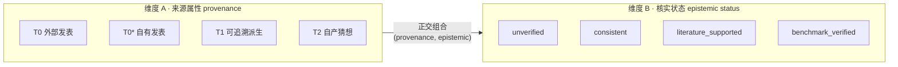
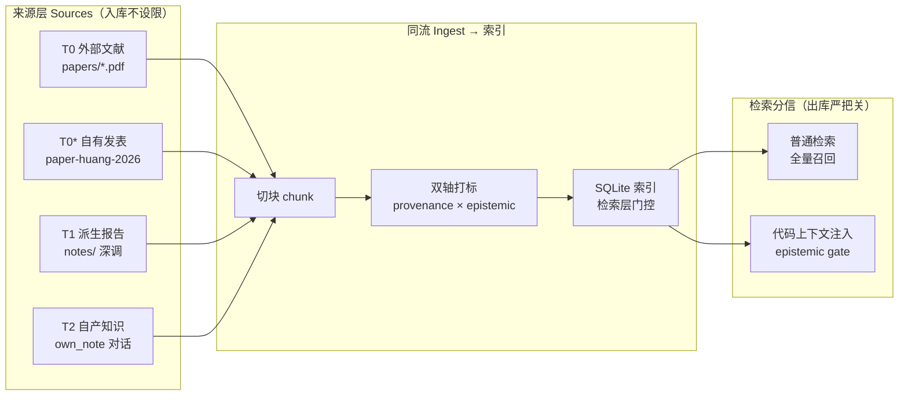
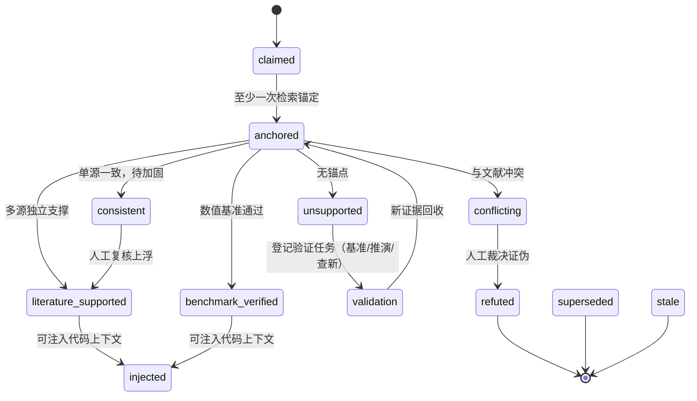
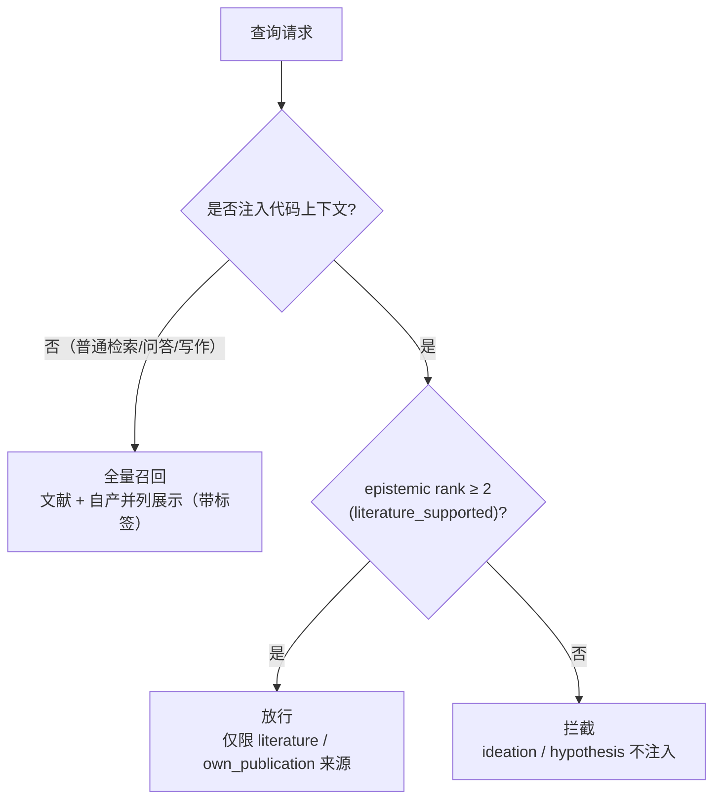

# 自产知识与文献"同流不同信"体系

## 设计草案 v0.1 · 科学汇报版

| 元数据 | 值 |
|---|---|
| 版本 | v0.1（2026-08-26 升版；v0 同日提出） |
| 性质 | 设计草案 + 决策记录 + 试点落地 |
| 状态 | 六项决策已全部裁决；P0+P1 已实施；试点 3 闭环通过 |
| 覆盖范围 | `spherical-wave-literature` 知识库 · `spherical_wave_mcp` 检索流水线 · `literature_harness` 状态机 |
| 配套报告 | `自产知识同流_试点报告_v0.1.md` |

---

## 摘要（Abstract）

多轮对话中持续产出自产知识（设计结论、技术判断、研究猜想），其可信度与既有文献知识天然不同。本草案提出**"同流不同信"**体系：把自产知识与文献知识纳入**同一条** ingest → 切块 → 打标 → 索引 → 检索流水线（同流），但通过**双轴打标**——来源属性（provenance）× 核实状态（epistemic status）——在**检索层**用门控区分可信度（不同信）。

核心机制：注入代码上下文前强制要求 `epistemic rank ≥ 2（literature_supported）`；机器只做保守锚定、永不自动升级；升级由人工周报复核裁决。v0.1 已落地 P0+P1，试点 3 跑通完整闭环（2066 chunks、14 条主张卡、0 条自动误升、门控拦截有效）。

---

## 1. 背景与动机

### 1.1 现状盘点：为什么"可以实现"

可行性并非从零论证——体系已具备 80% 地基：

| 现状事实 | 证据 | 对草案的含义 |
|---|---|---|
| 已是"单管道多源"模型 | `sources.yaml` 同时收录 `papers/` PDF（textbook）与 `notes/` 深调报告（supplementary_textbook） | **同流入口已存在**，不需新建管道 |
| 自有论文已入最高优先级 | `paper-huang-2026-pdcs`（Huang, Li... 2026 JCP 阴离子 PDCS），priority=1 | 自产学术产物"同流"已有先例 |
| 已有状态机与信用字段 | `state_machine.md` + `metadata_schema.md` 的 `state / review_status / confidence / relevance` | 信用体系可复用，只需**下沉粒度** |
| 已有每周审查机制 | 周度 review packet + 每周一 11:00 索引重建自动化 | 核实迭代节奏可复用 |

### 1.2 缺口诊断（草案要补的，不是新建的）

| # | 缺口 | 具体表现 |
|---|---|---|
| G1 | **认识论身份混淆** | 自产笔记、深调报告、自有论文、原始主张在 `sources.yaml` 全被标为 `supplementary_textbook`，无法区分"教材性转述"与"原始主张/猜想" |
| G2 | **状态机粒度错配** | `metadata_schema.md` 的置信字段是"文献条目级"；自产知识真伪几乎总要到**句子/断言粒度**才有意义 |
| G3 | **核实闭环缺失** | 自产文档入库后，无"自动检索文献锚定 → 升级已支撑 / 标记未支撑假设"机制 |
| G4 | **检索层无可信度门控** | 2026-08-13 诊断已点名：chunk 级元数据缺失、检索纯关键词+TF-IDF 无可信度过滤——恰是"自产混入文献"风险高发点 |

---

## 2. 设计核心：双轴打标

**关键判断："谁说的"（来源属性）与"验证过没有"（核实状态）是两个正交维度，绝不合并成一个标签。**

### 2.1 维度 A —— 来源属性（provenance tier）

| Tier | 定义 | 先验可信度 | 示例 |
|---|---|---|---|
| **T0** | 外部同行评审/已发表（可溯源） | 高（仍须核实） | `papers/` 论文、review、book |
| **T0\*** | 自有已发表（等同 T0 纳入注入门） | 高 | `paper-huang-2026-pdcs` |
| **T1** | 可追溯派生物（基于 T0 的推导/综述，锚点=文献链） | 中高 | 深调报告、Derivation 记录 |
| **T2** | 自产共识/猜想（对话中共同产物，暂无外部锚点） | 低（原点） | 多轮对话知识文档、方法论设想 |

### 2.2 维度 B —— 核实状态（epistemic status）

| 状态 | 含义 | Rank |
|---|---|---|
| `benchmark_verified` | 数值/自洽性基准通过 | 3 |
| `literature_supported` | 多源独立支撑 | **2（注入门槛）** |
| `consistent` | 单源一致，待加固 | 1 |
| `unverified` | 未核实（原点） | 0 |
| `conflicting` | 与文献冲突 → 人工裁决 | −1 |
| `refuted` / `superseded` / `stale` | 被证伪 / 被替代 / 会话内已修正 | −2 |

### 2.3 双轴关系示意（图 1）



> **图 1**：双轴打标为正交坐标系，任何断言落在 `(provenance, epistemic_status)` 交汇点。本源是 `metadata_schema.md` 现有 `confidence/review_status` 的自然推广——从"文献条目级"下沉到"主张/断言级"。

---

## 3. 系统架构：同流不同信流水线

### 3.1 总体流程（图 2）



> **图 2**：四类来源进入同一 ingest 管道（**同流**）；入库存放所有知识，检索层按用途分信（**不同信**）：信息类查询全量召回，代码上下文注入强制过门。

### 3.2 三条关键原则

1. **入口同**：自产知识进入同一 `ingest`，同一 chunk 规则、同一索引。
2. **chunk 级打标**：每个 chunk 携带 `{ provenance_tier, epistemic_status, claim_kind, evidence_chain, source_doc, project_module }`。
3. **门控在检索层，不在入库层**：入库不设限、出库严把关。

---

## 4. 主张生命周期状态机

### 4.1 状态迁移（图 3）



> **图 3**：主张生命周期。`claimed` 必须走到 `anchored` 才算完成采集；`unsupported` 不丢弃，登记为验证任务；唯一可注入代码上下文的门是 `literature_supported` / `benchmark_verified`。

### 4.2 claim_kind 分轨（"支撑义务"不同）

| claim_kind | 示例 | 是否强制文献锚定 | 可否注入代码上下文 |
|---|---|---|---|
| `fact` | "LB94 渐近行为决定截面精度" | 强制 | 可（须 literature_supported） |
| `derivation` | "动量空间 Born 核的化简" | 推演可复现即可 | 可（须 benchmark_verified） |
| `hypothesis` | "两个文献传统的融合在数学上成立" | 否 | **永不** |
| `workflow/notation` | 建目录规范、符号约定 | 否 | 否（仅人类使用） |

> **边界声明**：分轨不是资本放松"未审查不入代码"的黄金法则，而是把该法则**显式化到 chunk 级**。

---

## 5. 检索门控判定

### 5.1 判定流程（图 4）



> **图 4**：门控判定。`min_epistemic_status` 为检索参数，默认普通检索全量；代码上下文注入路径强制 rank ≥ 2 且仅放行 T0/T0* 来源。

### 5.2 门控排名表

```
benchmark_verified=3 > literature_supported=2 > consistent=1 > unverified=0
> conflicting=-1 > {refuted, superseded, stale}=-2
```

**注入代码上下文硬门槛：rank ≥ 2。**

---

## 6. 技术落地清单（含状态）

对应 2026-08-13 诊断的已知缺口（G1–G4）：

| # | 改动点 | 落点 | 状态 |
|---|---|---|---|
| P0-1 | `sources.yaml` 增加 `provenance` 字段；新 `source_type`：`own_note` / `claim_manifest` | `spherical_wave_mcp/config/sources.yaml` | ✅ |
| P0-2 | `metadata_schema.md` 增加 `provenance_tier, epistemic_status, claim_kind, evidence_chain, verify_granularity, last_verified` | `docs/literature_harness/metadata_schema.md` | ✅ |
| P0-3 | SQLite chunk 表加列（provenance, epistemic_status, claim_kind）+ 自动迁移 | `store.py` / `ingest.py` / `models.py` | ✅ |
| P1-4 | 主张级 registry：`index/registry/claims.yaml`（与 core/benchmark/risk 平行） | `tools/` | ✅ |
| P1-5 | `registry_query.py` + `semantic.py` 增加 epistemic 门控（`min_epistemic_status`） | `spherical_wave_mcp/src/` | ✅ |
| P1-6 | `tools/capture_claims.py`：会话文档 → 原子主张卡 + 保守锚定 | `tools/` | ✅ |
| P2-7 | review packet 增加"主张核实周报"节（gained / lost evidence，verification debt） | `weekly_review_packet_template.md` | ✅ 模板就位，随周报运行 |

---

## 7. 试点结果（v0.1，试点 3｜同流闭环）

| 验收项 | 指标 | 结果 |
|---|---|---|
| IC-1 同流 | own_note 与 literature 同一 ingest 管道 | ✅ 2066 chunks 单索引混合 |
| IC-2 打标 | 三轴元数据，默认 fail-closed | ✅ own_note → ideation/unverified/hypothesis |
| IC-3 门控 | gate 查询不召回未验证主张 | ✅ LB94 查询 gate 后 ideation 召回 = 0 |
| IC-4 抽取 | 对话文档 → 原子主张卡 ≥ 10 条 | ✅ 14 条（clm-0002..0015） |
| IC-5 锚定 | 机器不自动升级；锚点可追溯 | ✅ 0 条自动 literature_supported |
| IC-6 人工升级 | 人工可升级，gate 立即反映 | ✅ clm-0013 → 0→1 条 |
| IC-7 回归 | 既有功能不破坏 | ✅ pytest 8/8 |

**索引分布**：provenance（synth_summary 685 / literature 1365 / own_publication 13 / ideation 3）；epistemic（consistent 685 / literature_supported 1378 / unverified 3）；claim_kind（derivation 685 / fact 1378 / hypothesis 3）。

**关键结论**：LB94 查询普通召回下 own-note 排第 1 名（若不设门控会被当事实用）；加 gate 后仅剩文献命中。`query_claims(min_epistemic_status='literature_supported')` 初始 0 条，DY 人工核实 clm-0013 后 1 条通过。`query_by_module('separable_potential')` 合并返回 4 条文献 + 1 条主张。

---

## 8. 决策记录（已裁决，2026-08-26 DY 批复全部同意）

| # | 决策点 | 裁定 |
|---|---|---|
| D1 | 核实粒度 | **主张级为主 + chunk 继承（fail-closed）**；精确核实状态落主张卡，chunk 继承所含主张最差值 |
| D2 | 自产创新类分轨 | 按 `claim_kind` 分轨；hypothesis/workflow **永不注入**代码上下文为"事实" |
| D3 | T1 派生验证标准 | "推演可复现 + 数值自洽（benchmark）"为主；回原始文献逐条背书仅在需库级可信时触发 |
| D4 | 默认召回/注入策略 | **不注入代码上下文 + 检索全量召回** |
| D5 | 命名空间 | **合并 + 打标**（不改目录、不重切 chunk、避免索引重建） |
| D6 | 实施分期 | P0+P1 已在 v0.1 落地；P2 模板就位，随周报节奏运行 |

---

## 9. 风险与边界（不可违背项）

1. **黄金法则不放松**：`literature_harness/README.md` 的"未审查主张不得影响代码决策"必须保留，草案只把它下沉到 chunk 级。
2. **污染风险**：检索若无差别召回自产知识，SW Agent 会把未验证主张当事实用。→ epistemic gate 是**硬约束**，不是软提示。
3. **验证节奏成本**：核实迭代受人工审批上限约束。→ 默认策略 = 自动锚定 + 门槛处人工；verification debt 可视化，宁可拖延不可污染。
4. **T1 推导验证标准**：逐条推演可复现 + 数值自洽是否足够，或需回原始文献逐条背书（D3 已裁定前者为主）。

---

## 10. 下一步

**v0.1 已实施**（P0-1..7 全部落地，见 §6、§7）。

**下一轮验证周期（建议）**：

1. 12 条 `consistent` 主张人工周报复核（锚点正确性、是否上浮）。
2. clm-0001（GTO-FT + Lucchese 可分展开融合正确性）进入验证债务队列，择机跑推演/基准。
3. 重启 MCP connector 后验证 `query_claims_tool` / gate 参数端到端可用。
4. 视周报运行决定 `evidence_chain` 去重是否自动化。

---

## 附录 A：相关文件索引

| 文件 | 作用 |
|---|---|
| `docs/literature_harness/自产知识同流_试点报告_v0.1.md` | 试点 3 完整记录（IC、索引分布、修复） |
| `index/registry/claims.yaml` | 主张级 registry（15 卡） |
| `literature/tools/capture_claims.py` | 抽取 + 保守锚定工具 |
| `notes/对话知识_核实试点_2026-08-26.md` | own_note 试点语料 |
| `docs/literature_harness/weekly_review_packet_template.md` | 「主张核实周报」节 |
| `docs/literature_harness/metadata_schema.md` | 双轴打标规范（v0.1 节） |
| `spherical_wave_mcp/config/sources.yaml` | provenance 字段 + 打标约定 |
